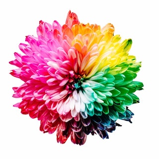

<!-- PROJECT SHIELDS -->
[![Xcode][xcode-shield]][xcode-url]
[![Swift][swift-shield]][swift-url]
[![Contributors][contributors-shield]][contributors-url]
[![Forks][forks-shield]][forks-url]
[![Stargazers][stars-shield]][stars-url]
[![Issues][issues-shield]][issues-url]
[![MIT License][license-shield]][license-url]

<!-- PROJECT LOGO -->
 

  

  <h3 align="center">Colors</h3>

  

    This is the source code for <i>Colors</i>, a sample app for demonstrating the new SwiftUI 2 application life cycle.

<!-- DEMO -->
## Demo

![Demo][product-demo]

<!-- CONTRIBUTING -->
## Contributing

Contributions are what make the open source community such an amazing place to be learn, inspire, and create. Any contributions you make are **greatly appreciated**.

1. Fork the project
2. Create your feature branch (`git checkout -b feature/AmazingFeature`)
3. Commit your changes (`git commit -m 'Add some AmazingFeature'`)
4. Push to the branch (`git push origin feature/AmazingFeature`)
5. Open a pull request

<!-- LICENSE -->
## License

See [LICENSE](LICENSE)

<!-- Disclaimer -->
## Disclaimer

This is not an official Google product.

<!-- ACKNOWLEDGEMENTS -->

## Acknowledgements

* The application icon is based on [a photo](https://unsplash.com/photos/iMdsjoiftZo) by [Sharon Pittaway](https://unsplash.com/@sharonp?utm_source=unsplash&amp;utm_medium=referral&amp;utm_content=creditCopyText) from [Unsplash](https://unsplash.com/?utm_source=unsplash&amp;utm_medium=referral&amp;utm_content=creditCopyText)
* Application artwork is based on the following original artwork from Unsplash:
  * [Yellow Umbrella](https://unsplash.com/photos/ym96FAhQ8o4) by [Catrin Johnson](https://unsplash.com/@simplelovelyuseful)
  * [Green and Blue Stick](https://unsplash.com/photos/yyrS4co2nPg) by [Fabio Tura](https://unsplash.com/@tfabb)
  * [Jamaican Cherries](https://unsplash.com/photos/FxzTFGxTk78) by [Henk van der Steege](https://unsplash.com/@steegeh)
  * [Blue and teal Abstract Painting](https://unsplash.com/photos/KZa4fREZoKk) by [Joel Filipe](https://unsplash.com/@joelfilip)
  * [Purple Petaled Flower](https://unsplash.com/photos/A-NEztaWTH0) by [Vjekoslav Domanović](https://unsplash.com/@vjeblackbirdlion)
  * [Pink Chair](https://unsplash.com/photos/CKLF34baCTQ) by [Willian Justen de Vasconcellos](https://unsplash.com/@willianjusten)

<!-- MARKDOWN LINKS & IMAGES -->
<!-- https://www.markdownguide.org/basic-syntax/#reference-style-links -->
[xcode-shield]: https://img.shields.io/badge/xcode-v12.0-blue
[xcode-url]: https://developer.apple.com/xcode/

[swift-shield]: https://img.shields.io/badge/swift-v5.3-%23fe4b2d
[swift-url]: https://swift.org/

[contributors-shield]: https://img.shields.io/github/contributors/peterfriese/Colors.svg?style=flat-square
[contributors-url]: https://github.com/peterfriese/Colors/graphs/contributors

[forks-shield]: https://img.shields.io/github/forks/peterfriese/Colors.svg?style=flat-square
[forks-url]: https://github.com/peterfriese/Colors/network/members

[stars-shield]: https://img.shields.io/github/stars/peterfriese/Colors.svg?style=flat-square
[stars-url]: https://github.com/peterfriese/Colors/stargazers

[issues-shield]: https://img.shields.io/github/issues/peterfriese/Colors.svg?style=flat-square
[issues-url]: https://github.com/peterfriese/Colors/issues

[license-shield]: https://img.shields.io/github/license/peterfriese/Colors.svg?style=flat-square
[license-url]: https://github.com/peterfriese/Colors/blob/master/LICENSE

[linkedin-shield]: https://img.shields.io/badge/-LinkedIn-black.svg?style=flat-square&logo=linkedin&colorB=555
[linkedin-url]: https://linkedin.com/in/peterfriese

[product-screenshot]: assets/screenflow.png
[product-demo]: Assets/demo.gif
[product-screenshot]: assets/screenshot.png "Screenshot of Colors, a sample app demonstrating the new SwiftUI 2 application life cycle"
